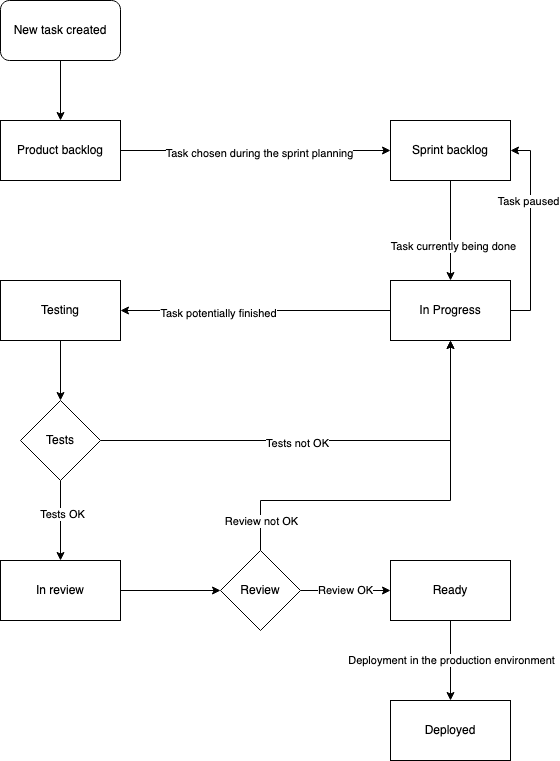

# Project description


# Functional requirements

- Sign in
- Sign up
- Login
- Password forgotten
- 2FA login
- Search logins
- Add username/password securely in the vault
- Remove logins from the vault
- Vault timeout: after n minutes of inactivity the vault become blocked and encrypted
- Generate secure password
- Store notes securely
- (FIDO2?)

# Non-functional requirements

- End-to-end encryption
- Zero-knowledge encryption


# Technologies

Front-end app:
- React + TypeScript
- Tailwind CSS

Back-end app:
- FastAPI + uvicorn (python)

CI/CD:
- Docker
- GitHub Actions
- TypeScript testing framework: Jest
- Python testing framework: pytest

# Architecture 

# Project Management

- Scrum
    - Sprint (1 week) planning each week on monday
    - Daily Scrum, 10-15'
    - Product Backlog
    - Sprint Backlog
    - Definition of Done (DoD)

Each sprint will cover 1 week with a daily scrum of 10-15 minutes long on each morning to plan our daily tasks. We'll also organized a little retrospective each evening to gather our difficulties of the day.

The Product Owner will review and accept each features before passing them from the "In review" to the "Deployed" column.

## Kanban organization

The scrum-related kanban will be implemented with GitHub Project linked to the organization DuckPass.

Here is a little summary of each column:

    - Product backlog: tasks to be done by the end of the project's deadline
    - Sprint backlog: tasks to be done by the sprint
    - In progress: tasks currently being done
    - Testing: tasks potentially finished but still need to be test
    - In review: tasks that need to be accepted by the Product Owner
    - Ready : tasks totally finished on the pre-prod env and accepted but need to be deployed on prod
    - Deployed: tasks deployed, accepted and tested on production



### Tasks priority
- High : Must be done today
- Medium : Must be done this week
- Low : No due date

### Tasks size
- Large (> 5h)
- Medium (2h < 5h)
- Small (1h < 2h)
- Tiny (< 1h)

## Branch naming convention

Code Flow Branches:
- `main`: prod
- `staging`: preprod (ready)
- `dev`: development

Temporary Branches:
- `feature/xxx`: any code change, must be related to an issue

## Commit convention

We'll follow the (Angular Commit Convention)[https://github.com/angular/angular/blob/22b96b9/CONTRIBUTING.md#-commit-message-guidelines] for commit messages:

The format will be the following:
```
<type>(<scope>): <subject>
<BLANK LINE>
<body>
<BLANK LINE>
<footer>
```

Each line must be less than 100 characters.

The footer should contain a closing reference to an issue if any.

The types we'll likely use are:
- chore (internal changes not related to the end-user)
- style
- feat
- refactor
- test
- fix
- docs

Here is an example:
```
feat(auth): Added user login page feature

Bla bla bla

Closed issue #10000
```

# Team member

- ANNEN Rayane: Product owner, frontend developer
- DUCOMMUN Hugo: Scrum Master, frontend developer
- MARTINS Alexis, Backend developer
- SAEZ Pablo, Backend developer