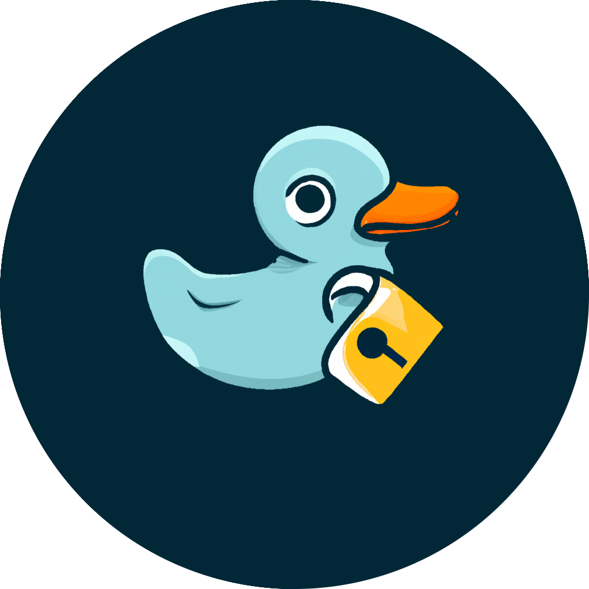

<p align="center">
  
</p>

# Project description

With the surge in cybersecurity incidents, the need to safeguard our data has become more pressing than ever. 
In 2022, Sortlist's statistics revealed a staggering exposure of 22 billion records due to over 4,100 data breaches. 
In the face of this landscape, digital security has taken center stage, both for businesses and individuals, who are keen on preserving the integrity of their information.

Current reality shows that 95% of hacking incidents stem from human errors and inadequate cybersecurity practices. 
Among prevailing bad habits, the use of predictable and easily discoverable credentials poses a significant threat. 
The complexity of remembering multiple strong passwords often leads to the adoption of easily memorable identifiers, subsequently resulting in their reuse.

The DuckPass project comes to life as an innovative password manager. 
Its aim? To aggregate and secure these intricate passwords, all while offering a seamless and reassuring experience. 
In addition to introducing a single master password requirement for easy access to the platform without compromising security, DuckPass sets itself apart by providing a groundbreaking feature. 
Users can now determine if their credentials have been compromised in previous data breaches, further enhancing their digital security. 
Armed with features like generating highly secure passwords, DuckPass is a robust solution fortified by end-to-end encryption, ensuring your data's security for complete peace of mind.

# Functional requirements

- Sign in
- Sign up
- Login
- Account deletion
- Indicator of the strength of the master password
- User profile page to view and edit information
- Password forgotten
- 2FA login
- 2FA manager for other apps
- Search logins
- Add username/password securely in the vault
- Remove logins from the vault
- Purge vault
- Password generator
- Integration of breached password search

# Non-functional requirements

- Application usage: 
  - The application must not be usable if the user is not logged in. They will be redirected to the home page, the login page and the account creation page.
  - When the account is created, the application must check that the password contains at least 8 characters and complies with at least 3 of the 4 following constraints: Use lower case, upper case, numbers and special characters.

- End-To-End Encryption (E2EE):
  - The data is encrypted from the moment the user enters it and throughout the process until it is stored on the server. On the server, the data remains encrypted until it returns to the user's device, where it is decrypted locally.

- Zero-Knowledge:
  - If users control the encryption key, they control access to the data and can provide encrypted data to the password manager without the password management company having access to the data and being able to query it.

- Transparency:
  - As an open-source project, we have to be totally transparent with users. They need to know the infrastructure through which their data passes, as well as all the code used by the application. In this way, DuckPass will be easy to audit and you will be able to check the underlying security measures for yourself.

- Privacy:
  - User data and activities should be kept private and not be accessible to unauthorized parties. This involves strict adherence to data protection regulations and user consent for data handling.

- Usability:
  - The user interface should be intuitive and user-friendly, requiring minimal training for users to effectively navigate and utilize the application's features.

# Technologies

Frontend app:
- React + TypeScript
- Tailwind CSS

Backend app:
- FastAPI + uvicorn (python)
- Gunicorn (Python web server WSGI)

CI/CD:
- Docker
- GitHub Actions
- TypeScript testing framework: Jest
- Python testing framework: pytest
- Hosting on Heroku for the backend
- Hosting on Netlify for the frontend

Domain :
- Cloudflare

# Architecture 


The web client is hosted on Netlify. We have two environments on Netlify, one for preproduction: https://staging.duckpass.ch and one for the production: https://duckpass.ch.

The application is built using Vite + React and Typescript, this main purpose of the application is to enable the user to decrypt or encrypt their data and access them. 

The server application never knows which data it is sending or receiving as everything is always encrypted by the web client.

Precisely, The user's encrypted information is sent to the API (hosted on Heroku) through a secure channel (HTTPS). The endpoint that retrieves the data will then process the data and store it in the database (PostgreSQL).

# Project Management

- Scrum
    - Sprint (1 week) planning each week on monday
    - Daily Scrum, 10-15'
    - Product Backlog
    - Sprint Backlog
    - Definition of Done (DoD)

Each sprint will cover 1 week with a daily scrum of 10-15 minutes long on each morning to plan our daily tasks. We'll also organized a little retrospective each evening to gather our difficulties of the day.

The Product Owner will review and accept each features before passing them from the "In review" to the "Deployed" column.

## Kanban organization

The scrum-related kanban will be implemented with GitHub Project linked to the organization DuckPass.

Here is a little summary of each column:

    - Product backlog: tasks to be done by the end of the project's deadline
    - Sprint backlog: tasks to be done by the sprint
    - In progress: tasks currently being done
    - Testing: tasks potentially finished but still need to be test
    - In review: tasks that need to be accepted by the Product Owner
    - Ready : tasks totally finished on the pre-prod env and accepted but need to be deployed on prod
    - Deployed: tasks deployed, accepted and tested on production


### Tasks priority
- High : Must be done today
- Medium : Must be done this week
- Low : No due date

### Tasks size
- Large (> 5h)
- Medium (2h < 5h)
- Small (1h < 2h)
- Tiny (< 1h)

## Branch naming convention

Code Flow Branches:
- `main`: prod
- `staging`: preprod (ready)
- `dev`: development

Temporary Branches:
- `feature/xxx`: any code change, must be related to an issue

Here is a little summary how to deal with them :


## Commit convention

We'll follow the [Angular Commit Convention](https://github.com/angular/angular/blob/22b96b9/CONTRIBUTING.md#-commit-message-guidelines) for commit messages:

The format will be the following:
```
<type>(<scope>): <subject>
<BLANK LINE>
<body>
<BLANK LINE>
<footer>
```

Each line must be less than 100 characters.

The footer should contain a closing reference to an issue if any.

The types we'll likely use are:
- chore (internal changes not related to the end-user)
- style
- feat
- refactor
- test
- fix
- docs

Here is an example:
```
feat(auth): Added user login page feature

Bla bla bla

Closed issue #10000
```

# CI/CD

DuckPass is built with two different environments : production and staging.

The staging environment is only used by the Product Owner to review the final result of the modifications. If the modifications are accepted the code is pushed onto the `main` branch (prod).

Here is a little diagram of the CI/CD pipeline :


The CI workflow is powered by GitHub Actions available on each repository which will in fact just run a `npm run test`.

The continuous deployment is managed by Netlify and Heroku portals directly linked to the repositories.

# Team member

- ANNEN Rayane: Product owner, frontend developer
- DUCOMMUN Hugo: Scrum Master, frontend developer
- MARTINS Alexis, Backend developer
- SAEZ Pablo, Backend developer
