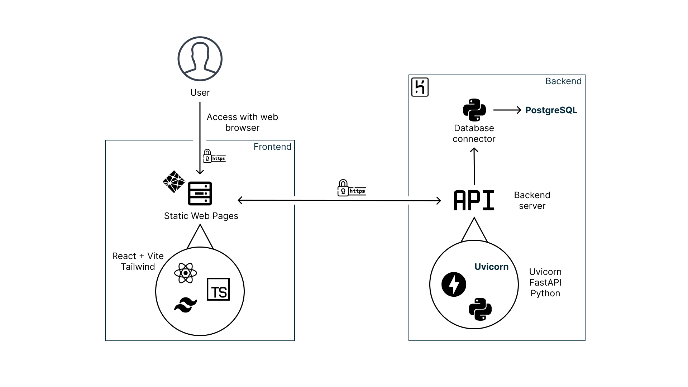
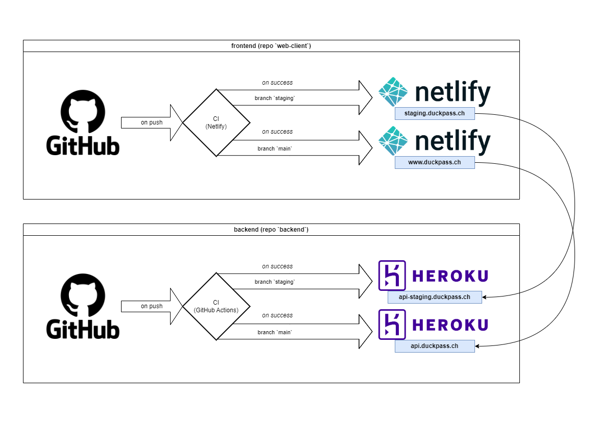
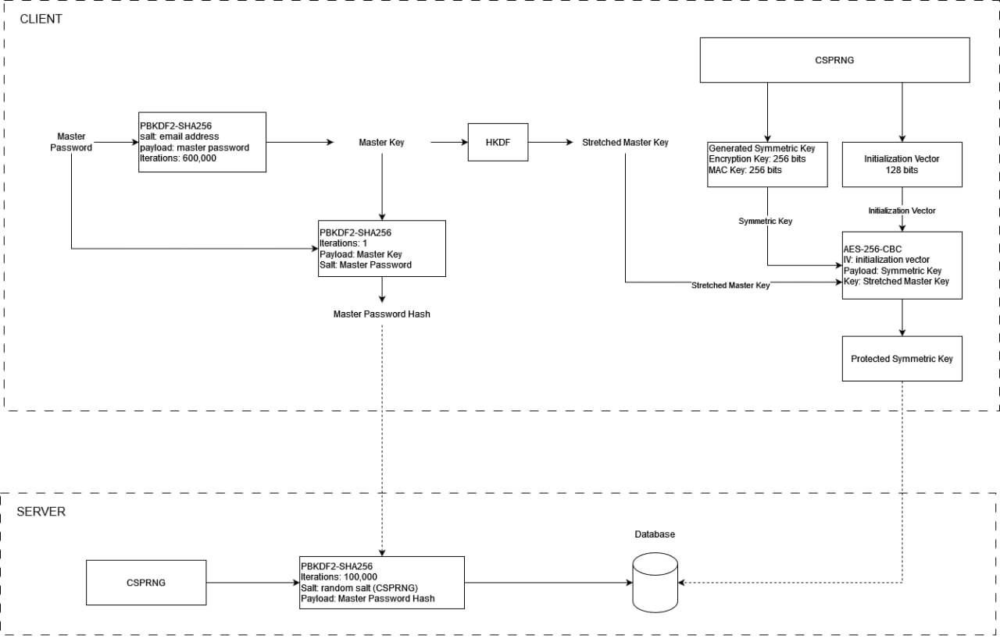
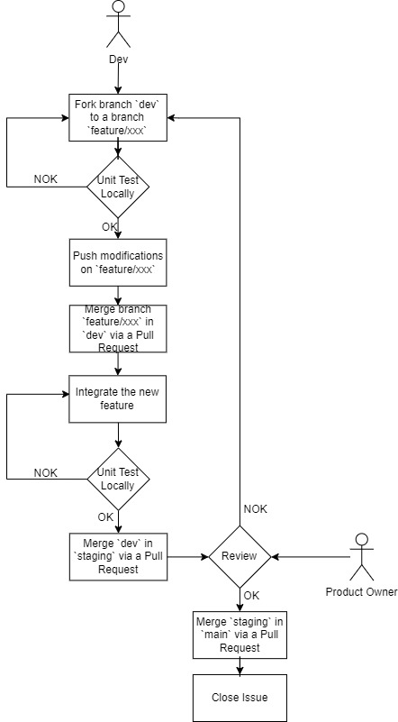

# Introduction

This report presents our group project called DuckPass, a simple and secure password manager. 

With the surge in cybersecurity incidents, the need to safeguard our data become more pressing than ever. Most incidents stem from human errors and inadequate cybersecurity practices. 

Among those bad habits, the use of weak and predictable credentials poses a significant threat. The complexity of remembering multiple strong password often leads to the adoption of easily memorables identifiers, subsequently resulting in their reuse.

Our project aims to aggregate these passwords, all while offering a simple and secure experience. 

To achieve that, we based our security model (that will be further explained) on industrial standards. We wanted to guarantee the following:

- End-to-End Encryption (E2EE): all information is transmitted securely over HTTPS
- Zero-Knowledge Encryption: we never know what a user stores in their vault and only them can access and modify it.

# Requirements

## Non functional requirements

- Application usage: 
  - The application must not be usable if the user is not logged in. They will be redirected to the home page, the login page and the account creation page.
  - When the account is created, the application must check that the password contains at least 8 characters and complies with at least 3 of the 4 following constraints: Use lower case, upper case, numbers and special characters.

- End-To-End Encryption (E2EE):
  - The data is encrypted from the moment the user enters it and throughout the process until it is stored on the server. On the server, the data remains encrypted until it returns to the user's device, where it is decrypted locally.

- Zero-Knowledge:
  - If users control the encryption key, they control access to the data and can provide encrypted data to the password manager without DuckPass having access to the data and being able to query it.

- Transparency:
  - As an open-source project, we have to be totally transparent with users. They need to know the infrastructure through which their data passes, as well as all the code used by the application. In this way, DuckPass will be easy to audit and you will be able to check the underlying security measures for yourself.

- Privacy:
  - User data and activities should be kept private and not be accessible to unauthorized parties. This involves strict adherence to data protection regulations and user consent for data handling.

- Usability:
  - The user interface should be intuitive and user-friendly, requiring minimal training for users to effectively navigate and utilize the application's features.


## Functional requirements

- Sign in
- Sign up
- Login
- Account deletion
- Indicator of the strength of the master password
- User profile page to view and edit information
- 2FA login
- 2FA manager for other apps
- Search logins
- Add username/password securely in the vault
- Remove logins from the vault
- Purge vault
- Password generator
- Integration of breached password search

# Technology stack and architecture

The architecture can be described with the following diagram:

{width=90%}

## Backend

The backend is made in python with the following technologies:

- FastAPI: a simple http framework that provides automatically an OpenAPI documentation with SwaggerUI.
- Uvicorn: an ASGI (Asynchronous Server Gateway Interface) server to deploy the API.
- PostgreSQL: a robust database

To test the application the python package `pytest` was used.

The application is deployed in Heroku using Gunicorn with uvicorn workers. 

## External services

- To send automated emails we use [Mailgun](https://www.mailgun.com/) 
- To verify passwords and emails breaches we use the [HaveIBeenPwned](https://haveibeenpwned.com/) API.

### Database

Schema:

- **User**(\underline{userid}, _email_, keyhash, symmetrickeyencrypted, salt, hastwofactorauth, twofactorauth, verified, created_at, vaultpassword): user accounts with their encrypted data.
- **RevokedToken**(\underline{token}): JWT tokens used for authentication that have been revoked.

It is important to recall that, that most user's information is encrypted, namely, the key's hash, the symmetric key encrypted and the vault, therefore they cannot be recovered (Zero-Knowledge Encryption).

We also created a file named `routine.sql` in the backend repository containing requests to be made periodically such as 

- Removing the unverified accounts

## Frontend

The frontend is a Single Page Application that interacts with the backend through an API. We used these technologies to build the app:

- Vite: the local development server, it monitors files as they're being edited and upon file save the web browser reloads the code being edited. 
- React: The frontend framework used to build the app. 
- TypeScript: It is a superset of Javascript that adds static typing and type annotations. It is more convenient and less error-prone compared to Javascript. 
- TailwindCSS: the CSS framework to stylize the app, it is pretty much used by most modern websites.

Once the application is built, the static web pages are served with netlify.

\clearpage

## CI/CD Pipeline

The pipeline is described by this diagram:



We have 2 environments: 

- staging: the preproduction environment, the Product Owner review every feature, once they are reviewed we push the modification on the main environment.
- main: the production environment: this is what the end user will see.

### Continuous Integration

- Backend: we use GitHub Actions, all tests are executed once a commit is pushed on the staging and main branches.
- Frontend: we use Netlify by running the test command before deploying on the staging and main branches.

### Continous Delivery

- Backend: we use Heroku to automatically deploy our application on the staging / main environment when a commit is pushed onto these branches. The deployment is only done if the CI passed.
- Frontend: we use Netlify to serve automatically the web pages on the staging / main environment when a commit is pushed. As well as the backend, the web app is deployed only if the CI passed.

\clearpage

## Security model

To make this project we were heavily inspired by the security model of [Bitwarden](https://bitwarden.com/). We used their security whitepaper to build our application. 

- Master Password: The password of the vault, it's where the user data protection begins. The overall security strength of the vault greatly relies on it as it is the secret used to access it. 
- To strengthen the security we implemented a two-step login.
- User Key: The symmetric encryption key used to encrypt and decrypt the vault. This key is encrypted using the _Master Key_ that is derived from the Master Password, no one except one that knows the master password can decrypt it. 

Below a more detailed diagram on how we make sure that know one -- even us -- except the user can access their vault.



The server only knows the double-hashed Master Password (as hash are one-way functions, we cannot recover the master password unless we try to bruteforce it which is at this time not realistically possible) and the encrypted user key (denoted as Protected Symmetric Key) generated during the account creation on the client.

From this diagram we knows that if one forgets their password, we cannot recover their vault as the vault is encrypted using the User Key which can only be decrypted using the Master Key (which derives from the forgotten password).

# Workflow

As shown in the first deliverable, we established a workflow that can be summarized with this diagram:

{width=50%}

1. One forks the `dev` branch.
2. Creates a new branch names it according to the branch naming convention `{feature,refactor,bugfix}/my-changes`.
2. Works on some specific patch.
3. Runs tests locally, fix them if they don't pass.
4. Once tests pass, pushes the modification on GitHub on the new branch.
5. If everything has been done a PR is made from the created branch and `dev`.
6. The merge occurs, the integration is made.
7. Check if the tests still pass.
8. If everything integrates correctly a PR is made from `dev` to `staging`
9. Once the branch is merged, the Product Owner review the modifications and if it's OK then the staging branch is merged in main
10. If there was issues linked to the modifications made then they must be closed.

# How to deploy locally

You can follow the instructions here: [https://github.com/Duck-Pass/self-host](https://github.com/Duck-Pass/self-host), a `.env` file will be provided so you can tests all features including those that needs API keys.

# How to contribute

In the `web-client` and `backend` repositories a `CONTRIBUTING.md` file is provided with instructions regarding how to contribute. 

Example from the web-client, the backend is quite similar: 

```
Thank you for contributing to our project, we'll be happy to add all improvements to DuckPass!

This document provides you guidelines on how to make a good submission.

# Submitting a Pull Request

1. Fork the application repository.
2. Make your change in a new git branch from `main`.
   - Please use the following naming convention: `{feature,refactor,bugfix, ...}/your-changes`.
   - `git checkout -b feature/my-new-feature main`
3. Create your patch, include appropriate tests cases.
4. Run the test suite.
5. Commit your changes accordingly.
6. Push your branch to GitHub.
7. Submit your pull request to `web-client:main`.
8. Your PR will be reviewed.
    - If you're asked to do some changes, make them and re-run the test suite, rebase your branch and push the changes to your repository.

Once step 8 is done, congratulations your PR has been accepted, thank you again for your contribution!

# Guidelines

We expect that you follow some rules before submitting a PR:

- All code, comments, etc. must be written in English.
- Explain your pull requests, what they should add, modify, or remove, how it should work, etc.
- If you use code from other projects, mark them accordingly and make sure their license allows the re-use.
- We follow the [Angular Commit Convention](https://github.com/angular/angular/blob/22b96b9/CONTRIBUTING.md#-commit-message-guidelines) for commit styling. 
- Use the provided configuration files for coding styles (e.g. Prettier and ESLint) 
```

You can find the formatted output **[here](https://github.com/Duck-Pass/web-client/blob/main/CONTRIBUTING.md)**.

# Deliverables

- Source code : 
    - Web Client (frontend): [https://github.com/Duck-Pass/web-client](https://github.com/Duck-Pass/web-client)
    - Back-end application: [https://github.com/Duck-Pass/backend](https://github.com/Duck-Pass/backend)
    - How to self-host the application: [https://github.com/Duck-Pass/self-host](https://github.com/Duck-Pass/self-host)

# References

- A large part of the cryptography part has been made with the inspiration of Bitwarden's source code that can be found at this address: [https://github.com/bitwarden/clients](https://github.com/bitwarden/clients). We also used their whitepaper to establish our strategy regarding how we should encrypt the data and derive the cryptographic keys: [https://bitwarden.com/help/bitwarden-security-white-paper/](https://bitwarden.com/help/bitwarden-security-white-paper/)

