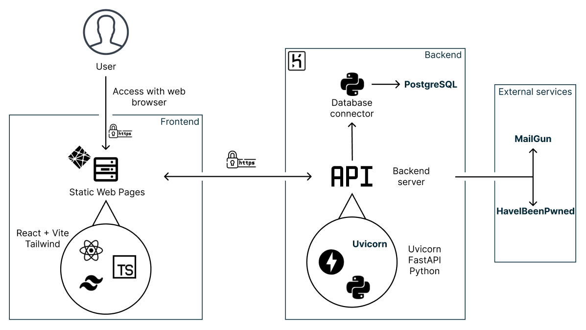

# Introduction

This report presents our group project called DuckPass, a simple and secure password manager. 

With the surge in cybersecurity incidents, the need to safeguard our data become more pressing than ever. Most incidents stem from human errors and inadequate cybersecurity practices. 

Among those bad habits, the use of weak and predictable credentials poses a significant threat. The complexity of remembering multiple strong password often leads to the adoption of easily memorables identifiers, subsequently resulting in their reuse.

Our project aims to aggregate these passwords, all while offering a simple and secure experience. 

To achieve that, we based our security model (that will be further explained) on industrial standards. We wanted to guarantee the following:

- End-to-End Encryption (E2EE): all information is transmitted securely over HTTPS
- Zero-Knowledge Encryption: we never know what a user stores in their vault and only them can access and modify it.

# Technology stack and architecture

The architecture can be described with the following diagram:

{width=90%}

## Backend

The backend is made in python with the following technologies:

- FastAPI: a simple http framework that provides automatically an OpenAPI documentation with SwaggerUI.
- Uvicorn: an ASGI (Asynchronous Server Gateway Interface) server to deploy the API.
- PostgreSQL: a robust database

To test the application the python package `pytest` was used.

The application is deployed in Heroku using Gunicorn with uvicorn workers. 

### Database

Schema:

- **User**(\underline{userid}, _email_, keyhash, symmetrickeyencrypted, salt, hastwofactorauth, twofactorauth, verified, created_at, vaultpassword): user accounts with their encrypted data.
- **RevokedToken**(\underline{token}): JWT tokens used for authentication that have been revoked.

It is important to recall that, that most user's information is encrypted, namely, the key's hash, the symmetric key encrypted and the vault, therefore they cannot be recovered (Zero-Knowledge Encryption).

## Frontend

The frontend is a Single Page Application that interacts with the backend through an API. We used these technologies to build the app:

- Vite: the local development server, it monitors files as they're being edited and upon file save the web browser reloads the code being edited. 
- React: The frontend framework used to build the app. 
- TypeScript: It is a superset of Javascript that adds static typing and type annotations. It is more convenient and less error-prone compared to Javascript. 
- TailwindCSS: the CSS framework to stylize the app, it is pretty much used by most modern websites.

Once the application is built, the static web pages are served with netlify.

## CI/CD Pipeline

The pipeline is described by this diagram:

We have 2 environments: 

- staging: the preproduction environment, the Product Owner review every feature, once they are reviewed we push the modification on the main environment.
- main: the production environment: this is what the end user will see.

### Continuous Integration

- Backend: we use GitHub Actions, all tests are executed once a commit is pushed on the staging and main branches.
- Frontend: we use Netlify by running the test command before deploying on the staging and main branches.

### Continous Delivery

- Backend: we use Heroku to automatically deploy our application on the staging / main environment when a commit is pushed onto these branches. The deployment is only done if the CI passed.
- Frontend: we use Netlify to serve automatically the web pages on the staging / main environment when a commit is pushed. As well as the backend, the web app is deployed only if the CI passed.

\clearpage

## Security model

To make this project we were heavily inspired by the security model of [Bitwarden](https://bitwarden.com/). We used their security whitepaper to build our application. 

- Master Password: this is the password of the vault, this is where the user data protection begins. The overall security strength of the application greatly relies on it as it is the secret used to access the vault. 
- To strengthen the security we implemented a two-step login.
- User Key: this is the symmetric encryption key used to encrypt and decrypt the vault. This key is encrypted using the _Master Key_ that is derived from the Master Password, no one except one that knows the master password can decrypt it. 

Below a more schematic explanation on how we make sure that know one -- even us -- except the user can access their vault.

The server only knows the double-hashed Master Password (as hash are one-way functions, we cannot recover the master password unless we try to bruteforce it which is at this time not realistically possible) and the encrypted user key (denoted as Protected Symmetric Key) generated during the account creation on the client.

From this diagram we knows that if one forgets their password, we cannot recover their vault as the vault is encrypted using the User Key which can only be decrypted using the Master Key (which derives from the forgotten password).

# Workflow

# How to deploy locally

# How to contribute

# Deliverables
